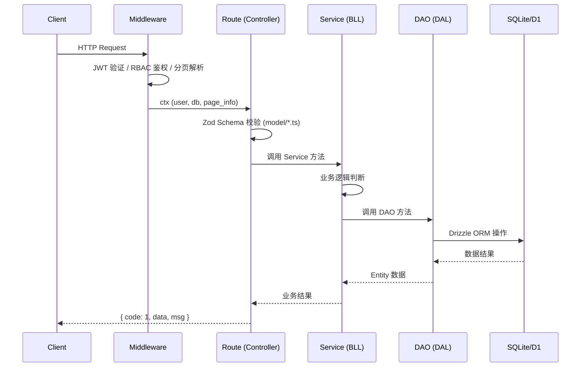

# CRM 框架设计规范

> 本文档受 [GoFrame 框架设计](https://goframe.org/docs/design) 启发，结合本项目的 TypeScript / Hono / Drizzle ORM / Cloudflare Workers 技术栈，制定适用于 CRM 项目的工程开发规范。
>
> **核心思想**：高内聚、低耦合、单向数据流、结构化参数、模型与业务分离。

---

## 一、模块化设计

### 1.1 什么是模块

模块（Module）是可复用的功能逻辑封装单位。在 TypeScript 工程中，一个 `export` 的文件或目录即可视为一个模块。

### 1.2 模块化目标

- **解耦**：模块之间通过接口（TypeScript Interface / Type）通信，而非直接引用内部实现。
- **复用**：通用能力提取到 `utils/`、`shared/` 中，业务模块按需引入。

### 1.3 模块复用三原则

| 原则 | 全称 | 含义 | 在本项目中的体现 |
|------|------|------|------------------|
| **REP** | 复用/发布等同原则 | 要复用就要抽模块 | `shared/codes.ts` 前后端共享错误码 |
| **CCP** | 共同闭包原则 | 因同一原因变更的代码归同一模块 | 每个路由文件聚合其相关的 Schema 与 Handler |
| **CRP** | 共同复用原则 | 不要强迫模块依赖它不需要的东西 | `utils/` 下每个工具函数独立导出，按需引入 |

### 1.4 模块聚合策略

本项目偏重 **CCP 原则**（可维护性优先）。核心通用模块由框架统一维护：

```
统一管理的核心模块
├── @shared/codes        # 错误码枚举（前后端共享）
├── db/schema            # Drizzle ORM 表结构定义
├── middleware/           # Hono 中间件（JWT、RBAC、分页）
├── utils/response       # 统一响应封装
└── constants/           # 全局常量
```

业务模块（`routes/`、`services/`）按需引用上述核心模块，但 **不允许** 核心模块反向依赖业务模块。

---

## 二、统一设计

### 2.1 技术体系化

本项目的技术栈选型遵循 **统一化** 原则，避免同类组件"百花齐放"导致的维护成本上升：

| 职责 | 统一选型 | 备选方案（禁止） |
|------|----------|------------------|
| HTTP 框架 | Hono | Express, Fastify |
| ORM | Drizzle | Prisma, TypeORM |
| 参数校验 | Zod | Joi, class-validator |
| 前端框架 | Vue 3 + Naive UI | Element Plus, Ant Design |
| 国际化 | vue-i18n (Natural Language Keys) | 自定义方案 |
| 构建工具 | Rsbuild (前端) / Wrangler (后端) | Vite, Webpack |

### 2.2 开发规范化

- **代码风格**：全局下划线前缀命名局部变量（`_db`, `_user`, `_parsed`），区分局部与全局。
- **API 协议**：所有接口返回 `{ code, data, msg }`，成功时 `code: 1`，失败时 `code < 0`。
- **数据清洗**：
  - 前端 Axios 拦截器：全局 `deepTrim()` 清除请求参数首尾空格（跳过 `password` 和 `FormData`）。
  - 后端 Zod Schema：所有 `z.string()` 字段必须链式调用 `.trim()`（`password` 除外）。

### 2.3 版本一致性

采用 **Monorepo 单仓管理模式**，共享 `@shared/` 前后端公共代码：

```
crm/
├── api/          # 后端（Cloudflare Workers）
├── web/          # 前端（Vue 3 + Rsbuild）
└── shared/       # 前后端共享（错误码、类型定义）
```

---

## 三、代码分层设计

### 3.1 为什么不用 MVC

传统 MVC 的 **Model 层**既维护数据又封装业务逻辑，随着业务复杂度增长会变得臃肿难维护。在前后端分离的场景下，**View 层已完全由前端接管**，服务端不再需要渲染模板。

### 3.2 三层架构设计

本项目采用 **改良的三层架构设计**（3-Tier Architecture），核心理念是将 MVC 中庞大的 Model 拆分为 **业务逻辑层（Service）** 和 **数据访问层（DAO）**：

```
┌──────────────────────────────────────────┐
│           表示层 (UI / Controller)         │
│  routes/*.ts — 接收请求、校验参数、返回响应  │
└────────────────────┬─────────────────────┘
                     │ 调用
┌────────────────────▼─────────────────────┐
│          业务逻辑层 (Service / BLL)        │
│  services/*.ts — 业务判断、流程编排、规则   │
└────────────────────┬─────────────────────┘
                     │ 调用
┌────────────────────▼─────────────────────┐
│          数据访问层 (DAO / DAL)            │
│  dao/*.ts — 纯数据库 CRUD 封装             │
└────────────────────┬─────────────────────┘
                     │
┌────────────────────▼─────────────────────┐
│          模型定义层 (Model / Entity)       │
│  db/schema.ts — Drizzle 表结构映射         │
│  model/*.ts — Zod Schema、业务类型定义     │
└──────────────────────────────────────────┘
```

### 3.3 分层调用规则

> [!IMPORTANT]
> 数据流必须是 **单向链路**，严禁跨层调用或反向依赖。

| 调用方 | 可以调用 | 禁止调用 |
|--------|----------|----------|
| Route (Controller) | Service, Model | DAO（不可直接操作数据库） |
| Service | DAO, Model | Route（不可反向调用控制器） |
| DAO | Model (Entity/Schema) | Service, Route |

---

## 四、工程目录设计

### 4.1 后端目录结构

```
api/src/
├── index.ts              # 入口：启动 Hono、注册路由
├── consts/                # 全局常量（限额、枚举值）        ← GoFrame: consts/
├── db/
│   └── schema.ts          # 🔒 Model/Entity — Drizzle 表结构（数据模型）
├── model/                 # 🔒 业务模型 — Zod Schema（Req/Res）← GoFrame: model/
│   ├── auth.model.ts      #    登录/注册参数定义
│   ├── contact.model.ts   #    联系人相关
│   ├── field.model.ts     #    字段配置相关
│   ├── group.model.ts     #    分组相关
│   └── user.model.ts      #    用户管理相关
├── dao/                   # 🔒 数据访问层 — 纯 CRUD 封装    ← GoFrame: dao/
│   ├── contact.dao.ts     #    → contact 表 + contact_log 表 + 统计聚合
│   ├── contact_field.dao.ts # → contact_field 表
│   ├── import_log.dao.ts  #    → import_log 表
│   ├── user.dao.ts        #    → user 表
│   ├── user_group.dao.ts  #    → user_group 表
│   └── user_log.dao.ts    #    → user_log 表
├── service/               # 🔒 业务逻辑层 — 业务流程编排    ← GoFrame: service/
│   ├── auth.ts
│   ├── contact.ts
│   ├── export.ts
│   ├── field.ts
│   ├── group.ts
│   ├── import.ts
│   ├── log.ts
│   ├── stat.ts
│   └── user.ts
├── controller/            # 🔒 表示层 — 路由 + 参数校验     ← GoFrame: controller/
│   ├── auth.ts
│   ├── contact.ts
│   ├── export.ts
│   ├── field.ts
│   ├── group.ts
│   ├── import.ts
│   ├── invite.ts
│   ├── log.ts
│   ├── stat.ts
│   └── user.ts
├── hono/                   # 框架胶水（Hono/Workers 特有）
│   ├── AppError.ts        #    业务异常类
│   ├── env.ts             #    Hono 环境类型声明
│   └── response.ts        #    统一响应封装（success/fail/paginate）
├── middleware/             # 中间件（JWT、RBAC、分页）
├── cron/                   # 定时任务
├── utility/                # 通用工具函数（纯函数，无框架依赖） ← GoFrame: utility/
└── __tests__/              # 单元测试
```

### 4.2 各层职责详解

#### Route（表示层 / Controller）

**职责**：接收请求参数 → 调用 Zod Schema 校验 → 调用 Service → 封装响应返回。

```typescript
// controller/user.ts — 示例
import { createUserSchema } from '@/model/user.model'
import { UserService } from '@/service/user'

userRouter.post('/', requireRole('superadmin'), async (c) => {
  const _parsed = createUserSchema.safeParse(await c.req.json())
  if (!_parsed.success) return fail(c, ErrorCode.VALIDATION_ERROR)

  const _result = await UserService.create(c.get('db'), _parsed.data, c.get('user'))
  return success(c, _result)
})
```

> [!WARNING]
> Route 层禁止出现 `db.select()` / `db.insert()` 等直接数据库操作。

#### Service（业务逻辑层 / BLL）

**职责**：业务判断、流程编排、多表协调。调用 DAO 进行数据操作，调用时传递 Model 定义的结构。

```typescript
// services/userService.ts — 示例
import { UserDao } from '@/dao/user.dao'

export const UserService = {
  async create(db: DrizzleD1, data: CreateUserInput, operator: AuthUser) {
    // 业务逻辑：检查用户名是否重复
    const _existing = await UserDao.findByUsername(db, data.username)
    if (_existing) throw new BizError(ErrorCode.DUPLICATE_USERNAME)

    // 业务逻辑：密码加密
    const _hashed = await hashPassword(data.password)

    // 调用 DAO 写入
    return UserDao.insert(db, { ...data, password: _hashed, created_by: operator.id })
  }
}
```

#### DAO（数据访问层 / DAL）

**职责**：纯数据库 CRUD 封装，**不包含任何业务判断逻辑**。

```typescript
// dao/user.dao.ts — 示例
import { user } from '@/db/schema'
import { eq } from 'drizzle-orm'

export const UserDao = {
  async findByUsername(db: DrizzleD1, username: string) {
    return db.select().from(user).where(eq(user.username, username)).get()
  },

  async insert(db: DrizzleD1, data: typeof user.$inferInsert) {
    return db.insert(user).values(data).returning().get()
  },

  async updateById(db: DrizzleD1, id: number, data: Partial<typeof user.$inferInsert>) {
    return db.update(user).set(data).where(eq(user.id, id)).run()
  }
}
```

> [!CAUTION]
> 只有 DAO 层允许直接引用 `db` 对象和 `drizzle-orm` 操作符。Service 层通过 DAO 暴露的方法间接操作数据库。

> [!IMPORTANT]
> **DAO 文件命名规范**：文件名必须与数据库表名保持一致（snake_case + `.dao.ts`）。
> 无独立表的聚合查询（如统计）应合并到对应表的 DAO 文件中。
> | 数据库表 | DAO 文件 |
> |----------|----------|
> | `contact` | `contact.dao.ts` |
> | `contact_field` | `contact_field.dao.ts` |
> | `import_log` | `import_log.dao.ts` |
> | `user` | `user.dao.ts` |
> | `user_group` | `user_group.dao.ts` |
> | `user_log` | `user_log.dao.ts` |

#### Model（模型定义层）

模型分为两类：

| 类型 | 位置 | 职责 | 对应 GoFrame |
|------|------|------|-------------|
| **数据模型 (Entity)** | `db/schema.ts` | 与数据库表一一对应 | `model/entity` |
| **业务模型 (Schema)** | `model/*.ts` | 接口入参/出参定义（Zod） | `api` Req/Res |

```typescript
// model/user.model.ts — 示例
import { z } from 'zod'

// 对外接口的入参定义（等同于 GoFrame 的 api Req）
export const createUserSchema = z.object({
  username: z.string().trim().min(3).max(20).regex(/^[a-zA-Z0-9_]+$/),
  password: z.string().min(8),    // password 不 trim
  role: z.enum(['staff', 'manager']).default('staff'),
  group_id: z.number().optional(),
})

export type CreateUserInput = z.infer<typeof createUserSchema>
```

> [!IMPORTANT]
> `model/` 中的业务模型 **不应直接暴露** `db/schema.ts` 的数据模型给外部接口。数据模型的修改不应直接影响 API 接口的兼容性。

---

## 五、结构化编程设计

### 5.1 问题：非结构化参数

非结构化的参数传递会导致以下问题：
- 参数顺序容易记错
- 新增参数时需修改所有调用方
- 无法自动校验和转换

```typescript
// ❌ 反面示例：散装参数
async function createUser(username: string, password: string, role: string, groupId?: number) { ... }
```

### 5.2 解决方案：Zod Schema + TypeScript Interface

```typescript
// ✅ 正面示例：结构化参数
const createUserSchema = z.object({ ... })
type CreateUserInput = z.infer<typeof createUserSchema>

async function createUser(db: DrizzleD1, input: CreateUserInput) { ... }
```

**优势**：
1. 参数自包含、自描述，无顺序依赖
2. 新增字段只需修改 Schema，调用方无感知
3. Zod 自动完成类型校验、转换、清洗（`.trim()`）
4. TypeScript 编译期类型检查

---

## 六、数据访问层（DAO）封装设计

### 6.1 痛点

在没有 DAO 封装的情况下，ORM 调用散落在各个 Route / Service 中：
- 表名、字段名硬编码，修改时影响面不可控
- 相同的查询逻辑在多处重复
- 无法统一进行审计日志、软删除等横切关注点

### 6.2 改进方案

每张核心表封装一个 DAO 对象，提供语义化的 CRUD 方法：

```typescript
// dao/contact.dao.ts
export const ContactDao = {
  findByPhone: (db, phone) => db.select().from(contact).where(eq(contact.phone, phone)).get(),
  findById:    (db, id)    => db.select().from(contact).where(eq(contact.id, id)).get(),
  insert:      (db, data)  => db.insert(contact).values(data).returning().get(),
  softDelete:  (db, id)    => db.update(contact).set({ deleted_at: new Date() }).where(eq(contact.id, id)).run(),
}
```

### 6.3 数据操作权限收口

> [!IMPORTANT]
> 只有 `dao/` 层被允许直接引用 `drizzle-orm` 的 `eq`、`like`、`sql` 等操作符。这确保了数据操作的 **单一收口**，便于全局审计和变更追踪。

---

## 七、请求分层流转

一个完整请求的数据流转：



---

## 八、安全规范

### 8.1 数据入库安全

| 层级 | 措施 | 负责人 |
|------|------|--------|
| 前端 | `v-model:value.trim` + Axios `deepTrim` 拦截器 | 视图层 |
| 后端 Schema | Zod `.trim().min().max().regex()` | 模型层 |
| 后端 DAO | Drizzle 类型约束 + `notNull()` / `unique()` | 数据层 |

### 8.2 密码安全

- `password` 字段在前后端均 **豁免** trim 处理
- 存储使用 `bcrypt` / `scrypt` 单向哈希
- 传输通过 HTTPS + JWT 加密

### 8.3 权限控制

基于 RBAC 中间件 `requireRole()`，三级角色体系：

```
superadmin > manager > staff
```

---

## 九、与 GoFrame 三层架构的映射关系

| GoFrame (Go) | 本项目 (TypeScript) | 说明 |
|---|---|---|
| `api/` (Req/Res 定义) | `model/*.model.ts` (Zod Schema) | 接口参数的结构化定义 |
| `controller/` | `controller/*.ts` | 接收参数、校验、分发、响应 |
| `service/` (BLL) | `service/*.ts` | 业务逻辑编排，调用 DAO |
| `dao/` (DAL) | `dao/*.dao.ts` | 纯数据库 CRUD 封装 |
| `model/entity` | `db/schema.ts` | Drizzle 表结构定义（数据模型） |
| `model/do` | Drizzle `$inferInsert` 类型 | 写操作的数据对象 |
| `consts/` | `consts/` | 全局常量 |
| `middleware/` | `middleware/` | 中间件（JWT、RBAC、分页） |
| `utility/` | `utility/` | 通用工具函数 |

---

## 十、渐进式演进策略

本项目当前处于 **快速迭代阶段**，不要求一步到位地完成全面重构。采用 **渐进式** 策略：

### 阶段一：模型层收口（已完成）
- [x] Zod Schema 统一添加 `.trim()` 清洗
- [x] 前端 Axios 拦截器全局 `deepTrim()`
- [x] 数据库 Schema 统一定义在 `db/schema.ts`

### 阶段二：DAO 层抽离（已完成）
- [x] 为核心表（`contact`、`user`、`field`、`importLog`、`group`、`stat`、`log`）创建 DAO 封装
- [x] 从 `routes/*.ts` 中剥离直接 `db.` 调用，迁移至 DAO

### 阶段三：Service 层完善（已完成）
- [x] 将 `routes/` 中的复杂业务逻辑抽取至 `services/`
- [x] Service 只调用 DAO，不直接操作 `db`
- [x] `importService` 严格模式：所有 DB 操作下沉至 DAO

### 阶段四：Model 层标准化（已完成）
- [x] 创建 `model/` 目录，将 Zod Schema 从 `routes/` 顶部迁入
- [x] 每个业务模块对应一个 `*.model.ts` 文件

> [!TIP]
> 每个阶段完成后，通过运行 `bun test` 确保所有单元测试通过，再进入下一阶段。

---

## 参考文献

- [GoFrame 模块化设计](https://goframe.org/docs/design/modular)
- [GoFrame 统一框架设计](https://goframe.org/docs/design/unified)
- [GoFrame 代码分层设计](https://goframe.org/docs/design/project-layer)
- [GoFrame 工程目录设计](https://goframe.org/docs/design/project-structure)
- [GoFrame DAO 封装设计](https://goframe.org/docs/design/project-dao)
- [GoFrame 结构化编程设计](https://goframe.org/docs/design/project-struct-parameter)
- [GoFrame 数据模型与业务模型](https://goframe.org/docs/design/project-models)
