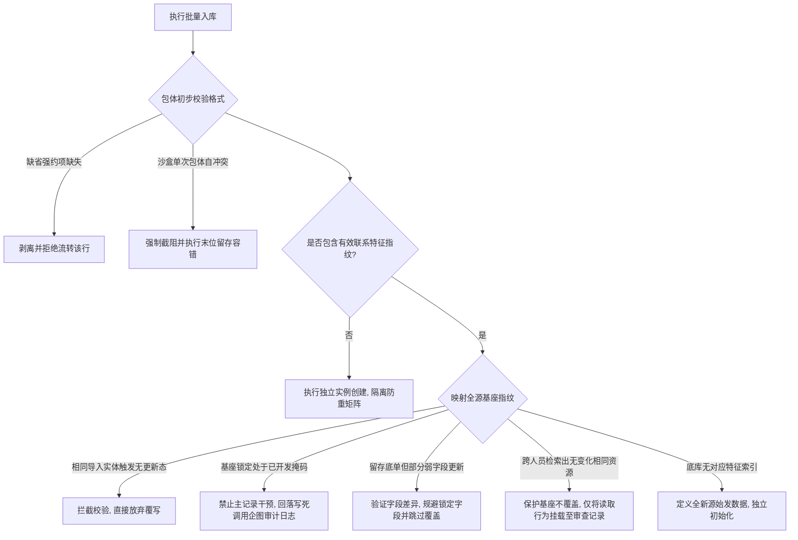

# 粉库系统 — 需求文档

> **版本**：v4.1  
> **日期**：2026-04-06  
> **原则**：极简、实用、快速上线

---

## 一、要解决的问题

公司有大量海外客户数据，需要：
1. **批量结构化录入**时，**自动执行全域防撞去重**，并**生成**数据追溯审计日志
2. 业务员执行检索查重，并对未开发资源执行**认领归属操作**
3. **沉淀**全量底层数据，包括完整的**导入追踪、状态变更及查询监控记录**

---

## 二、组织架构与角色

### 层级结构

```text
超管（全局管理）
 ├── 部门 A（内含：管理、业务员1、业务员2）
 └── 部门 B（内含：管理、业务员4、业务员5）
```

### 三个角色

| 角色 | 代码 | 说明 |
|------|------|------|
| 超管 | `superadmin` | 全系统管理，**所有权限** |
| 管理 | `manager` | 部门负责人，管理本部门人员和统计 |
| 业务员 | `staff` | 日常操作，查询客户、标记状态 |

### 权限矩阵

| 功能 | 超管 | 管理 | 业务员 |
|------|:----:|:----:|:-----:|
| 查询客户（**全局共享**） | ✅ | ✅ | ✅ |
| 认领客户资产 | ✅ | ✅ | ✅ |
| 导入数据 | ✅ | ✅ | ❌ |
| 查看个人统计 | ✅ | ✅ | ✅ |
| 查看本部门统计 | ✅ | ✅ | ❌ |
| 查看本部门查询审计记录 | ✅ | ✅ | ❌ |
| 管理本部门人员 | ✅ | ✅ | ❌ |
| 客户资产跨权配置（转移） | ✅ | ✅ | ❌ |
| 查看所有部门统计 | ✅ | ❌ | ❌ |
| 管理部门（增删改） | ✅ | ❌ | ❌ |
| 动态配置字段管理 | ✅ | ❌ | ❌ |
| 全局数据安全导出 | ✅ | ❌ | ❌ |
| 撤销已开发资产状态 | ✅ | ❌ | ❌ |
| 修改/删除任意资产记录 | ✅ | ❌ | ❌ |
| 核心系统设置管理 | ✅ | ❌ | ❌ |

> 客户数据**全局共享**，所有部门的人都可以查询任何客户。部门的作用是管理人员和统计业绩。
> **考虑到数据防泄露，全系统限制严格的导出权限，仅超管可导出数据。**

---

## 三、核心概念

### 总库

存放所有客户数据的地方。每个客户**一条主记录**，始终保持**最新数据**，同时保留**完整的导入历史**。

- 主键用自增ID，**不依赖任何业务字段**
- 去重规则：**手机号相同 = 同一客户**
- 手机号不是必填的——没有手机号的记录**直接新建，不参与去重**
- 同一人重复导入且数据没变化，**直接拒绝**
- **文件内部容错去重**：读取文件时，如果有重复号码，系统**自动容错并保留最后一行**进行入库，不会因个别重复导致整个文件拒绝导入
- 有变化的重导入会**更新主记录**并**记录差异**
- 不同人导入同一客户但数据没变，只记录审计日志。

### 状态与资源管理

系统实施精简的双状态资源控制模型，实现全域数据去重与防碰撞保护。客户记录在系统中仅存在以下两种状态：

| 状态 | 业务定义 | 说明 | 导入与覆盖规则 |
|------|------|------|---------|
| **未开发 (undeveloped)** | **公海资源** | 全局可见，系统内任何人均可查询并认领入库 | 允许正常更新记录 |
| **已开发 (developed)** | **私有资源** | 业务员查询未发生碰撞并认领后，资产归属其个人名下 | **冻结主记录，严格禁止覆盖** |

**防碰撞与资产保护机制**：
- **90天排他防碰撞期**：客户状态一旦标记为【已开发】，其归属权即绑定至对应业务员，触发全域拦截保护。**跌落机制**：该保护期时效为 90 天，若期满未追加特定转化锚点标签（如【已入金/VIP】）或向超管提请续期锁定，系统将自动行使回收指令，将改实体抹除一切归属痕迹并跌回【未开发】公海。
- **全局掩码查重**：为防止通过查询接口抓取资产数据，当系统内任意平级账号查询已被其他人标记为【已开发】的客户记录时：
  1. 系统返回占位符提示：“该数据已录入系统”，并拒绝任何跟进或覆盖操作。
  2. 接口层对该记录的关键联系方式字段强制应用掩码处理（如 `123****6789`）。
  *(注：该掩码限制不包括超级管理员账户，超管拥有全局明文审阅权限。)*

> **前端操作流规范（举例）：**
>
> 1. 业务员李四在外部独立通讯软件中触达新联系人（123456789）。
> 2. 交互前，李四在系统内执行号码检索 `123456789` 进行防重确认。
> 3. **结果A（无记录或未开发）**：系统未检索到已有归属，李四执行【认领】操作，该联系人状态变更为【已开发】并绑定李四。
> 4. **结果B（已开发）**：系统拦截并掩码提示 `123****6789 (王五开发)`，李四确认该记录已有归属，停止跟进。

#### 系统审计日志
尽管前端应用精简了多级流转状态，底层数据层依然保留了完整的操作审计链路：
- **静默留痕**：管理员触发的大批量资源导入，以及因防写保护未能成功覆盖主记录的导入行为，系统均会完整生成对应的 `import_log` 和 `contact_log`，供系统稽核及数据回溯。

---

## 四、各角色操作

### 业务员

系统实施**纯邀请制注册**，不开放自主注册通道。管理或超管通过签发**每日动态流转的 O(1) 掩码邀请码**来发放注册资格，新用户凭邀请码完成注册后自动归入对应部门。

注册环节仅需提交用户名、高强度密钥（加密存储，规格：最小8位，强制包含大小写字母与数字组合）及有效邀请码。

> **高危权限控制：系统未开放自助密码找回通道。一切凭证遗失事件需向超管或部门管理层发起重置工单。**

#### 查询与编辑

搜索条件（默认模糊查询，输入 "Wang" 能查出 "Wang Wu"）：
- **高级筛查**：前端视图必须支撑基于动态字段（如“意向级别”、“客户来源”）的交叉聚合过滤。

> ⚠️ **底层 API 搜索机制规定**：底层 API **必须支持**以全量原始号码进行精确或模糊匹配。但如果搜出的是【他人的私海客户】，后端返回给前端的数据**必须将联系方式强行掩码**（如 `+668****5678`），并在界面提示“已命中，当前为张三私海”，**严防黑客绕过接口直接抓取明文**。

查询结果呈现规范（可能返回多条匹配数据）：
1. **已开发（被他人占有）**：列表仅展示设置时间及对应的归属人员用户名。**关键联系方式强制予以星号掩码处理**（如 `123****5678`），禁用关联资料编辑与操作入口。
2. **未开发（尚未归属）**：展示完整的最新业务表单信息。
   - **资料修改**：业务员可编辑更新尚未被安全锁定的属性字段。
   - 查询审阅跟踪（历史检索人员及时间区间记录）
   - **[确认认领] 操作按钮**
3. **无结果项**：输出未匹配提示，并激活 [新建并认领] 功能入口。

#### 客户认领与状态固定

- 若业务员检索对象匹配状态为无记录或【未开发】，可直接触发认领指令。
- 认领动作必须呼出**确认弹窗**防止误操。
- 一旦记录更新为【已开发】并附加了发起者标识，即刻绑定为当事人员专属业务数据，其余非高权限账号请求全部触发脱敏防碰撞拦截机制。


#### 个人统计

阅览个人归属名下的认领资产总量及转化明细图表。

> 所有的检索动作将会触发底层系统无感知快照（包括检索发起人、检索时间及入参特征），并统一归档以供高级权限溯源审查。

### 管理（部门负责人）

管理拥有业务员的全部功能，另外还有：

#### 批量导入

**操作步骤：**
1. 上传 Excel/CSV 文件（**单次最大支持 10MB**，超限由前端引导用户切割文件。系统在解析时若发现文件内有重复号码，会**自动保留文件内最后一条数据**容错）。
2. 系统自动处理，**排除同一导入人已导入且数据无变化**的号码，比对剩下的数据差异。
3. 显示导入报告：
   - 🎯 **合规投递条数**：1000
   - 📄 **沙盒内去重合并**：2（文件内部重复数据自动整合）
   - ⏭️ **有效数据覆盖排除**：50（比对无差异数据自动略过）
   - ✅ **正式入库成功**：950（含新录入 670，存量更新 200，不同人员重复归集 80）
   - ⚠️ **受保护【已开发】资源拦截**：50（主记录受防写保护，已登记拦截企图于审计库）
   - 🔒 **锁定字段冲突**：3（提示：`+66812345678 姓名被锁定，需联系超管`）
   - 📋 **总库重复列表**：展示此次导入涉及的总库已有持有人/状态
4. 点击确认入库完成流转。

#### 部门管理

- 查看本部门业务员的转化统计（按月查询）
- 管理本部门业务员账号（分配账号 / 审核注册 / 禁用 / 授权导入权限）
- **客户资产交接**：办理员工离职调岗等交接，可将离职业务员名下的【已开发】绝密客户**一键转移**至同部门其他人员名下
- 查看本部门人员的查询记录

### 超管

超管拥有管理的全部功能，另外还有：

- 管理部门（创建 / 编辑 / 删除）
- 管理所有用户（跨部门）
- 跨部门客户资产交接转移
- 全系统数据导出
- 查看所有部门的统计数据
- 查看全部查询记录（支持按号码/人员搜索）
- 撤销已开发状态（需日志强制留取）
- 动态字段管理（增删改查 / 排序）
- 系统配置
- 修改/删除任意数据

---

## 五、固源防重矩阵 (去重规则)

导入作业序列校验流转矩阵：



> 对应的审计追踪报告视图参照第五部「四、各角色规范 → 批量归集」。

---

## 六、查询记录

每次查询客户时统**自动记录**：

| 记录内容 | 说明 |
|----------|------|
| 检索用户标识 | 触发此次查询操作的对象实体 |
| 检索入参特征 | 发起搜索动作时所提交的指纹或关键词集合 |
| 动作发生时间截 | 查询接口被触发的精准系统时间 |
| 匹配响应结果 | 服务端传回的数据击中条数 |

### 查询统计

系统自动统计查询行为，用于**安全监控**：

| 统计项 | 说明 |
|----------|------|
| 个人历史请求总量 | 账号存续周期内的累计查询次数 |
| 单体日聚合频次 | 自然日内所发起的总检索量（**异常高频即刻触发爬虫或违规撞库预警**） |
| 目标实体热度指数 | 特定客户档案被不同内部账号交叉检索的总次数 |

具备相应权限的控制端用户可执行以下操作：
- **资源靶向溯源**：通过指定客户标识反向追踪曾获取过该资源的所有员工（**防泄漏底线审查**）
- **人员行为侧写**：基于业务主体追踪其发起的所有单向数据抽调动作轨迹（**内鬼追踪与风控**）
- 精确时间区间界定过滤
- （部门协同控制）部门级管理账户权限隔离，仅允许检索其下属业务网单元的活动流水。

> 查询记录和导入变更记录在 UI 上分开显示，是两个独立区域。

示例：

> **查询统计示例**：李四今日查询 156 次（远超正常工作频次，触发异常警报：可能涉及非法数据抓取）。

---


## 八、动态字段

客户数据的字段由超管在后台配置，不需要改代码。

**架构配置**：初始类型支持涵盖 `文本`、`手机号`、`下拉单选`、`数值` 及 `时间选项` 等。系统默认嵌置的核心字段包括：`手机号` (全局防重凭证)、`姓名` (强制项)、`性别`、`年龄`、`国家`、`省市区跨国组件`、`社交账号` 及 `转化来源` 等。

超管可以：
- 新增字段
- 编辑字段
- 禁用字段（不删数据，前端不再显示）
- 拖拽排序
- 设置必填（导入时缺少必填字段则**拒绝**该行被导入）
- **锁定字段安全限制**：超管可设置字段“**是否允许业务员手工修改**”。一旦锁定，业务员**只能查看**。且外部导入数据时如果锁定字段的值与库内不一致，**不覆盖旧值**，但会亮红提示冲突。

> 举例：
>
> | 手机号 | 字段 | 库内值 | 导入值 | 结果 |
> |--------------|------|---------|---------|------|
> | +66812345678 | 姓名 | Wang Wu | Li Si | ❌ 不覆盖，姓名已锁定 |
>
> 提示业务员：号码可能换了主人，找超管处理。

> 手机号是固定的去重字段，**不能删**。但手机号不必填，没手机号的记录直接新建。

---

## 九、资产沉淀统计

系统对标记为【已开发】的资源将严格归集于认领人名下。客户端统计看板在呈递时度/月度留存指标时，必须配套部署柱状或折线可视化图表，建立直观的数据洞察矩阵。

- 业务员侧：观测个人专属名下的认领成效趋势及漏斗细分
- 管理节点层：统揽管辖团队内部的归属占比排名及月度阶梯曲线
- 顶层超管轴：全局洞悉跨团队的归属渗透率及多维交叉比对

示例数据表结构：

| 部门 | 归属人员 | 本期内认领总量 | 历史积淀总计 |
|------|--------|:-------:|:-------:|
| 部门A | 王五   | 128     | 562     |
| 部门A | 李四   | 95      | 430     |
| 部门B | 张三   | 67      | 289     |

---

## 十、多语言

界面支持中英文切换，默认中文。动态业务数据/枚举**维持原生内容不强翻**，界面的功能按钮和固有文字走国际化。切换后**即时生效**。
